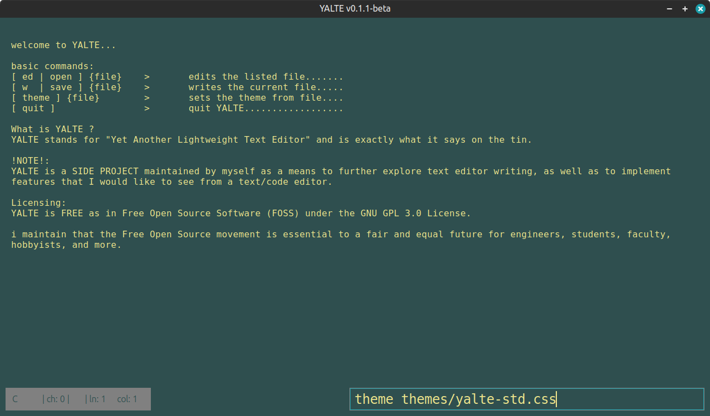

# YALTE

 

## What is YALTE ?
YALTE stands for "Yet Another Lightweight Text Editor" and is
exactly what it says on the tin.

> [!NOTE]
> YALTE is a SIDE PROJECT maintained by myself as a means to
> further explore text editor writing, as well as to implement
> features that I would like to see from a text/code editor.

## Features
currently YALTE is in-development.

### Upcoming Features
- basic text editing capabilities
- file saving and loading
- opening a file from the cmdline

## Licensing
YALTE is FREE as in Free Open Source Software (FOSS) under the 
GNU GPL 3.0 License. 

i maintain that the Free Open Source movement is essential to a 
fair and equal future for engineers, students, faculty, hobbyists,
and more.
